# ClusterCord Extended Features (v2.0)

## The Next Generation of Kubernetes Management

These 6 features transform ClusterCord from a powerful tool into **the definitive platform** for Kubernetes management, DevOps collaboration, and infrastructure automation.

---

## Table of Contents

- [16. Terminal Recording & Playback](#16-terminal-recording--playback)
- [17. Homelab Cluster Templates](#17-homelab-cluster-templates)
- [18. Chaos Engineering Integration](#18-chaos-engineering-integration)
- [19. RBAC Visualizer](#19-rbac-visualizer)
- [20. Cluster SSO (Discord OAuth)](#20-cluster-sso)
- [21. Plugin System](#21-plugin-system)

---

## 16. Terminal Recording & Playback

### 🎯 The Problem

Security and compliance teams need:
- Complete audit trail of what was executed
- Ability to review sessions for training
- Forensic analysis of incidents
- Proof of compliance for audits

### ✨ The Solution

ClusterCord records EVERY terminal session with full playback capability.

### Commands

```
/terminal record session:abc123  # Start recording
/terminal playback session:abc123  # Watch replay in Discord
/terminal download session:abc123  # Download as TTY recording
/terminal export session:abc123 format:json  # Export structured data
```

### Recording Format

```json
{
  "session_id": "abc123",
  "user": "@alice",
  "cluster": "production",
  "pod": "api-xyz",
  "namespace": "prod",
  "start_time": "2024-01-15T10:00:00Z",
  "duration": 300,
  "frames": [
    {
      "timestamp": 0.0,
      "type": "input",
      "data": "ls -la\n"
    },
    {
      "timestamp": 0.1,
      "type": "output",
      "data": "total 48\ndrwxr-xr-x..."
    },
    {
      "timestamp": 5.2,
      "type": "input",
      "data": "cat /app/config.json\n"
    },
    {
      "timestamp": 5.3,
      "type": "output",
      "data": "{\n  \"database\": \"..."
    }
  ],
  "commands": [
    "ls -la",
    "cat /app/config.json",
    "ps aux",
    "exit"
  ],
  "exit_code": 0
}
```

### Playback in Discord

Bot sends messages that "replay" the session:

```
🎥 Replaying session abc123

User: @alice
Pod: api-xyz (namespace: prod)
Started: 2024-01-15 10:00:00
Duration: 5m 0s

[00:00] $ ls -la
[00:00] total 48
[00:00] drwxr-xr-x 2 root root ...
[00:05] $ cat /app/config.json
[00:05] {
[00:05]   "database": "postgresql://..."
[00:05] }
[00:10] $ ps aux
...

⏸️ Pause | ⏩ Fast Forward | ⏪ Rewind | 🛑 Stop
```

### Advanced Features

**Speed Control:**
```
/terminal playback session:abc123 speed:2x
```

**Jump to Command:**
```
/terminal playback session:abc123 jump:5  # 5th command
```

**Search in Recording:**
```
/terminal search session:abc123 query:"SELECT * FROM"
```

**Export Formats:**
- **JSON**: Structured data for analysis
- **TTY**: Compatible with asciinema player
- **Text**: Plain text transcript
- **HTML**: Shareable web page

### Retention Policy

```
/terminal retention set days:90 cluster:prod
/terminal retention set days:365 namespace:compliance
```

Auto-delete recordings after specified period.

### Compliance Features

**Redaction:**
Auto-redact sensitive data:
```
Database password: ************
API key: sk_live_***************
JWT token: eyJ***************
```

**Access Control:**
Only session owner + admins can view recordings

**Audit Trail:**
Log who viewed which recording and when

### Use Cases

**1. Security Incident Response:**
```
Alert: Unusual command "rm -rf /" attempted
Review session recording to see full context
```

**2. Training:**
```
Share recording of successful deployment
New team members can watch and learn
```

**3. Compliance Audits:**
```
Auditor: "Show me all production database access"
Export all recordings with tag:database
```

**4. Debugging:**
```
Issue: "It worked when I ran it yesterday"
Replay yesterday's session to compare
```

### Implementation

**Database:** `TerminalRecording` model (already created)

**Storage:**
- Small sessions (<10MB): PostgreSQL JSONB
- Large sessions: S3/MinIO with metadata in DB

**Compression:**
- gzip for JSON
- Deduplication for repeated output

---

## 17. Homelab Cluster Templates

### 🎯 The Problem

Setting up common stacks (media server, Minecraft, GitLab) requires:
- Finding the right manifests
- Configuring values
- Dealing with dependencies
- Hours of troubleshooting

### ✨ The Solution

**One-click deployment of pre-configured stacks!**

### Commands

```
/template search category:media
/template info template:plex-stack
/template deploy template:plex-stack namespace:media
/template list-deployed cluster:homelab
/template update deployment:abc123
/template delete deployment:abc123
```

### Available Templates

#### 🎮 Gaming Category

**Minecraft Server Stack**
```yaml
includes:
  - Minecraft server (Java/Bedrock)
  - Backup cron job (every 6h)
  - Web map (Dynmap/BlueMap)
  - RCON console
  - Automatic restart on crash

resources:
  cpu: 2 cores
  memory: 4Gi
  storage: 10Gi

variables:
  - server_name: "My Server"
  - difficulty: "normal"
  - max_players: 20
  - enable_whitelist: true
```

**Palworld Dedicated Server**
**Valheim Server**
**Terraria Server**
**Counter-Strike 2 Server**

#### 📺 Media Category

**Complete Media Stack**
```yaml
includes:
  - Plex Media Server
  - Sonarr (TV shows)
  - Radarr (Movies)
  - Prowlarr (Indexer manager)
  - qBittorrent
  - Jellyfin (alternative to Plex)
  - Overseerr (request management)

features:
  - Auto-organization
  - Subtitle download
  - Hardware transcoding (if GPU available)
  - Reverse proxy with HTTPS

storage:
  media: 1Ti (configurable)
  downloads: 500Gi
```

**Jellyfin Only Stack** (lightweight)
**Music Stack** (Navidrome + Lidarr)
**Photo Stack** (Immich + PhotoPrism)

#### 🛠️ Development Category

**GitLab Complete**
```yaml
includes:
  - GitLab CE
  - GitLab Runner (Docker + K8s executors)
  - Container Registry
  - PostgreSQL
  - Redis
  - MinIO (for artifacts)

features:
  - Auto DevOps enabled
  - CI/CD templates
  - HTTPS with cert-manager
  - SSO with OAuth
```

**Jenkins + SonarQube Stack**
**Gitea Lightweight Stack**
**Development Database Cluster** (Postgres + Redis + MongoDB)

#### 📊 Monitoring Category

**Complete Observability Stack**
```yaml
includes:
  - Prometheus
  - Grafana
  - Loki
  - Tempo (tracing)
  - AlertManager
  - Node Exporter
  - Blackbox Exporter

dashboards:
  - Kubernetes cluster overview
  - Application performance
  - Node metrics
  - Cost tracking

alerts:
  - High CPU/memory
  - Pod crashes
  - Certificate expiry
  - Disk space
```

#### 💾 Database Category

**Postgres HA Cluster**
```yaml
includes:
  - PostgreSQL Operator (Zalando)
  - 3-node cluster
  - Automatic failover
  - Backup to S3/MinIO
  - PgBouncer connection pooling
  - pgAdmin web UI
```

**MySQL/MariaDB Cluster**
**Redis Cluster**
**MongoDB Replica Set**
**Cassandra Cluster**

#### 💬 Messaging Category

**RabbitMQ Cluster**
**Apache Kafka Stack**
**NATS Cluster**

#### 🔄 CI/CD Category

**ArgoCD + Tekton**
**Flux + Kustomize**
**Drone CI**

### Template Structure

```json
{
  "name": "plex-stack",
  "version": "1.0.0",
  "category": "MEDIA",
  "description": "Complete Plex media server with automation",
  "icon": "🎬",
  "author": "clustercord-community",
  "verified": true,
  "popularity": 1250,

  "requirements": {
    "kubernetes_version": ">=1.24",
    "nodes": 1,
    "cpu": "2",
    "memory": "4Gi",
    "storage": "100Gi",
    "features": ["LoadBalancer", "PersistentVolumes"]
  },

  "variables": [
    {
      "name": "plex_claim_token",
      "type": "string",
      "required": true,
      "description": "Get from https://plex.tv/claim",
      "secret": true
    },
    {
      "name": "media_path",
      "type": "string",
      "default": "/mnt/media",
      "description": "Path to media files"
    },
    {
      "name": "enable_hardware_transcoding",
      "type": "boolean",
      "default": false,
      "description": "Requires GPU"
    }
  ],

  "manifests": [
    "namespace.yaml",
    "plex-deployment.yaml",
    "plex-service.yaml",
    "sonarr-deployment.yaml",
    "radarr-deployment.yaml",
    "prowlarr-deployment.yaml",
    "qbittorrent-deployment.yaml",
    "ingress.yaml"
  ],

  "helm_charts": [
    {
      "repo": "k8s-at-home",
      "chart": "plex",
      "version": "6.4.3",
      "values": "plex-values.yaml"
    }
  ],

  "post_install": [
    "Access Plex at https://plex.${DOMAIN}",
    "Default username: admin",
    "Configure Sonarr at https://sonarr.${DOMAIN}",
    "Add indexers in Prowlarr first"
  ]
}
```

### Deployment Flow

1. **Select Template:**
```
/template search category:media

Results:
🎬 Plex Complete Stack (⭐ 1250)
🎵 Music Server Stack (⭐ 890)
📷 Photo Management (⭐ 650)
```

2. **Review Details:**
```
/template info template:plex-stack

Shows:
- Requirements
- Components
- Variables needed
- Estimated resource usage
```

3. **Deploy:**
```
/template deploy template:plex-stack namespace:media

Bot asks for variables:
Enter plex_claim_token: [input]
Enter domain: plex.home.local
Enable hardware transcoding? [Yes/No]

Deploying... ████████████ 100%
✅ Deployed successfully!
```

4. **Access:**
Bot DMs:
```
🎬 Plex Stack Deployed!

Access URLs:
- Plex: https://plex.home.local
- Sonarr: https://sonarr.home.local
- Radarr: https://radarr.home.local

Default credentials:
Username: admin
Password: [generated]

Next steps:
1. Configure Plex with your claim token
2. Add indexers in Prowlarr
3. Link Sonarr/Radarr to Prowlarr
4. Add media folders

Need help? Check /template guide template:plex-stack
```

### Community Templates

**Submit Template:**
```
/template submit file:my-template.json
```

**Validation:**
- Syntax check
- Security scan
- Resource estimate
- Test deployment

**Approval:**
- Community voting
- Maintainer review
- Verification badge for trusted templates

### Social Proof

This will **explode** on:
- r/homelab
- r/selfhosted
- YouTube homelab channels
- TikTok tech creators

**Why?**
- Solves THE biggest pain point
- One command vs hours of work
- Perfect for beginners
- Appeals to everyone

---

## 18. Chaos Engineering Integration

### 🎯 The Problem

Testing resilience requires:
- Complex chaos tools (Litmus, ChaosMesh)
- Knowledge of CRDs and configurations
- Cleanup after experiments
- Risk of permanent damage

### ✨ The Solution

**Safe, Discord-native chaos experiments!**

### Commands

```
/chaos kill-pod pod:api-123 namespace:prod
/chaos pod-failure pod:api-123 duration:5m
/chaos network-delay pod:api-123 latency:100ms duration:2m
/chaos cpu-stress pod:api-123 percent:80 duration:3m
/chaos drain-node node:worker-2 timeout:10m
/chaos run-experiment file:experiment.yaml
/chaos list namespace:prod
/chaos stop experiment:abc123
```

### Built-in Experiments

#### Pod Chaos

**Kill Pod:**
```
/chaos kill-pod pod:api-abc123

Kills pod immediately
Kubernetes will recreate it
Tests pod restart resilience
```

**Pod Failure (longer downtime):**
```
/chaos pod-failure pod:api-abc123 duration:5m

Makes pod unavailable for 5 minutes
Tests failover and recovery
```

#### Network Chaos

**Network Delay:**
```
/chaos network-delay pod:api-abc123 latency:200ms jitter:50ms

Adds 200ms ± 50ms latency
Tests timeout handling
```

**Network Loss:**
```
/chaos network-loss pod:api-abc123 percent:30

Drops 30% of packets
Tests retry logic
```

**Network Corruption:**
```
/chaos network-corruption pod:api-abc123 percent:5

Corrupts 5% of packets
Tests error handling
```

#### Resource Chaos

**CPU Stress:**
```
/chaos cpu-stress pod:api-abc123 percent:90 duration:3m

Consumes 90% CPU for 3 minutes
Tests under load
Monitors for OOMKill
```

**Memory Stress:**
```
/chaos memory-stress pod:api-abc123 size:1Gi duration:5m

Allocates 1Gi memory
Tests memory limits
Watches for eviction
```

**Disk Stress:**
```
/chaos disk-stress pod:api-abc123 workers:4 duration:2m

Heavy disk I/O
Tests disk saturation
```

#### Node Chaos

**Drain Node:**
```
/chaos drain-node node:worker-2

Safely evicts all pods
Tests rescheduling
Ensures no downtime
```

**Node Restart:**
```
/chaos node-restart node:worker-2

Simulates node failure
Tests cluster resilience
```

### Experiment Reports

After experiment:

```
📊 Chaos Experiment Report

Experiment: network-delay-test
Type: NETWORK_DELAY
Target: api-abc123 (namespace: prod)
Duration: 5m 0s
Status: ✅ COMPLETED

Configuration:
- Latency: 200ms ± 50ms
- Affected connections: 15

Observations:
✅ Application remained available
✅ No errors in logs
⚠️  Response time increased by 180ms
⚠️  2 timeout warnings detected

Impact:
- Request success rate: 98.5% (target: >95%)
- P99 latency: 850ms (normal: 120ms)
- Error rate: 0.02%

Recommendations:
✅ System is resilient to network latency
Consider increasing timeout from 1s to 2s for better UX
```

### Safety Features

**Dry Run:**
```
/chaos kill-pod pod:api-123 dry_run:true

Shows what would happen without doing it
```

**Namespace Protection:**
```
/chaos config protect namespace:production

Requires confirmation for production experiments
```

**Blast Radius Limits:**
```
/chaos config max_pods:1 namespace:prod

Only 1 pod affected at a time
```

**Auto-Rollback:**
If service becomes completely unavailable, experiment stops

**Approval Required:**
For destructive experiments, require admin approval

### Experiment Templates

**High Availability Test:**
```yaml
name: ha-test
steps:
  - kill-pod: api-1
  - wait: 30s
  - assert: healthy_replicas >= 2
  - kill-pod: api-2
  - wait: 30s
  - assert: healthy_replicas >= 1
```

**Cascade Failure Test:**
```yaml
name: cascade-test
steps:
  - network-delay: database, latency: 500ms
  - observe: api error_rate
  - assert: error_rate < 5%
```

### Integration with Chaos Tools

**Litmus:**
```
/chaos litmus-install
/chaos litmus-workflow file:workflow.yaml
```

**ChaosMesh:**
```
/chaos mesh-install
/chaos mesh-experiment file:experiment.yaml
```

**Native Chaos:**
ClusterCord implements basic chaos without dependencies

### Use Cases

**1. Validate HA Setup:**
```
Kill one replica
Verify service stays up
Verify new replica starts
```

**2. Test Autoscaling:**
```
CPU stress pods
Watch HPA scale up
Verify performance
```

**3. DR Testing:**
```
Drain entire node
Verify pods reschedule
Verify data persists
```

**4. GameDays:**
```
Schedule monthly chaos experiments
Team practices incident response
Build confidence in systems
```

---

## 19. RBAC Visualizer

### 🎯 The Problem

Understanding RBAC is hard:
- Who can do what?
- Which ServiceAccount has which permissions?
- Are there over-permissioned accounts?
- Compliance audits need visual proof

### ✨ The Solution

**Generate beautiful RBAC graphs!**

### Commands

```
/rbac visualize namespace:prod
/rbac visualize user:@alice
/rbac visualize cluster:prod format:svg
/rbac audit cluster:prod
/rbac export cluster:prod format:pdf
```

### Graph Types

#### Entity-Resource Graph

Shows: User → RoleBinding → Role → Resources

```
@alice
  └─ RoleBinding: alice-admin
      └─ Role: namespace-admin
          ├─ pods (get, list, delete)
          ├─ services (get, list, create, update)
          └─ configmaps (get, list)

@bob
  └─ RoleBinding: bob-viewer
      └─ Role: read-only
          ├─ pods (get, list)
          └─ services (get, list)
```

#### Permission Matrix

|  | pods | services | secrets | deployments |
|--|------|----------|---------|-------------|
| @alice | ✅ CRUD | ✅ CRUD | ❌ | ✅ CRUD |
| @bob | ✅ Read | ✅ Read | ❌ | ✅ Read |
| sa/api | ✅ Read | ✅ Read | ✅ Read | ❌ |

#### Network Diagram (SVG)

Beautiful visual graph showing relationships:

```mermaid
graph LR
    Alice[👤 @alice] --> RB1[RoleBinding: alice-admin]
    Bob[👤 @bob] --> RB2[RoleBinding: bob-viewer]
    RB1 --> R1[Role: namespace-admin]
    RB2 --> R2[Role: read-only]
    R1 --> Pods[📦 Pods: CRUD]
    R1 --> Svc[🔌 Services: CRUD]
    R2 --> Pods2[📦 Pods: Read]
    R2 --> Svc2[🔌 Services: Read]
```



### Audit Features

**Over-Permissions Detection:**
```
⚠️ RBAC Audit Findings

HIGH RISK:
- ServiceAccount 'legacy-app' has cluster-admin (all namespaces)
  Recommendation: Scope to specific namespace

- User @charlie has delete access to secrets
  Last used: Never
  Recommendation: Remove unused permission

MEDIUM RISK:
- 5 users have wildcard (*) verbs on pods
  Recommendation: Specify exact verbs needed

LOW RISK:
- ServiceAccount 'backup-job' has list access to all namespaces
  Acceptable if needed for backup
```

**Unused Permissions:**
```
These permissions have never been used:

- @alice: configmaps.delete (granted 90 days ago)
- @bob: secrets.create (granted 60 days ago)
- sa/worker: deployments.update (granted 30 days ago)

Recommend: Remove to follow least privilege
```

**Anomaly Detection:**
```
🚨 Suspicious Activity Detected

ServiceAccount 'app-reader' attempted:
- Delete pod (DENIED) - unusual for read-only account
- Create secret (DENIED) - never attempted before

Recommendation: Review if account is compromised
```

### Export Formats

**SVG:**
Scalable vector graphic, embeddable in docs

**PDF:**
Professional report with:
- Cover page
- Executive summary
- Detailed permissions
- Audit findings
- Recommendations

**JSON:**
Machine-readable for automation

**Markdown:**
GitHub/Confluence friendly

**Graphviz DOT:**
For custom rendering

### Interactive Features

**Discord Interactive:**
```
Click on @alice
  → Shows all their RoleBindings
    → Click on RoleBinding
      → Shows Role details
        → Click on Role
          → Shows exact permissions
```

**Web UI Version:**
- Zoom and pan
- Filter by user/namespace
- Search for specific permissions
- Export subgraphs

### Use Cases

**1. Onboarding:**
Show new team members what they can access

**2. Compliance:**
Generate audit reports for SOC 2

**3. Security Review:**
Find over-permissioned accounts

**4. Incident Response:**
"Who could have deleted that pod?"

---

## 20. Cluster SSO (Discord OAuth)

### 🎯 The Problem

Developers need kubectl access but:
- Sharing kubeconfigs is insecure
- Managing certificates is complex
- No centralized access control
- Hard to revoke access quickly

### ✨ The Solution

**Discord OAuth for kubectl access!**

### How It Works


### Commands

```
/sso login cluster:prod
/sso logout cluster:prod
/sso list-sessions
/sso revoke session:abc123
/sso extend session:abc123 duration:2h
```

### Login Flow

```
User: /sso login cluster:prod

Bot DMs:
🔐 SSO Login Request

Click to authorize:
https://discord.com/oauth2/authorize?client_id=...

This will grant you kubectl access to:
Cluster: production
Namespace: prod, staging
Duration: 8 hours

Permissions:
- View pods, services, logs
- Create/update deployments
- No delete access to production

[Authorize] [Cancel]
```

After approval:

```
✅ SSO Login Successful!

Download your kubeconfig:
[Download kubeconfig.yaml]

Or copy to clipboard:
```yaml
apiVersion: v1
kind: Config
clusters:
- cluster:
    server: https://api.prod.k8s.local
  name: production
contexts:
- context:
    cluster: production
    user: alice-discord-sso
  name: prod
current-context: prod
users:
- name: alice-discord-sso
  user:
    token: eyJhbGc...
```

Install:
export KUBECONFIG=~/kubeconfig-prod.yaml
kubectl get pods

Expires: 2024-01-15 18:00:00 (8 hours)

To extend: /sso extend
```

### Token Management

**Short-Lived Tokens:**
- Default: 8 hours
- Max: 24 hours
- Auto-refresh if used actively

**Revocation:**
```
/sso revoke session:abc123

Immediately invalidates token
Kubectl commands will fail
User must re-authenticate
```

**Audit:**
Every kubectl command logged with:
- Discord user
- Timestamp
- Command executed
- Result (allowed/denied)

### Permission Mapping

**Discord Role → Kubernetes RBAC:**

```yaml
mappings:
  "Admin":
    namespaces: ["*"]
    permissions: ["cluster-admin"]

  "Developer":
    namespaces: ["dev", "staging"]
    permissions: ["developer-role"]

  "Viewer":
    namespaces: ["*"]
    permissions: ["view"]
```

### Security Features

**IP Whitelisting:**
```
/sso config allow_ips:192.168.1.0/24,10.0.0.0/8
```

Only allow kubectl from office/VPN

**MFA Required:**
```
/sso config require_mfa:true
```

Requires Discord 2FA enabled

**Device Trust:**
```
First login from new device requires admin approval
```

**Session Limits:**
```
Max 3 active sessions per user
Oldest auto-revoked when exceeded
```

### Use Cases

**1. Contractor Access:**
```
Grant time-limited access
Auto-expires after project ends
No long-term credentials
```

**2. Team Onboarding:**
```
New dev joins
Admin approves Discord role
Instant kubectl access
```

**3. Emergency Access:**
```
On-call engineer needs access
/sso login cluster:prod duration:2h
Automatically revoked after shift
```

**4. Compliance:**
```
All access logged with Discord identity
Easy to audit who did what
Revoke all access instantly if needed
```

---

## 21. Plugin System

### 🎯 THE Game Changer

This makes ClusterCord **infinitely extensible**.

Community can build:
- Custom commands
- Integration with any tool
- Domain-specific functionality
- Company-specific workflows

### Architecture

```
packages/plugins/
├── minecraft-plugin/
│   ├── manifest.json
│   ├── commands/
│   │   ├── server-status.ts
│   │   ├── restart.ts
│   │   └── backup.ts
│   ├── hooks/
│   │   ├── on-pod-start.ts
│   │   └── on-pod-crash.ts
│   └── package.json
├── database-plugin/
│   ├── manifest.json
│   ├── commands/
│   │   ├── create-db.ts
│   │   ├── backup-db.ts
│   │   └── restore-db.ts
│   └── services/
│       └── postgres-operator.ts
└── monitoring-plugin/
    ├── manifest.json
    └── integrations/
        ├── datadog.ts
        ├── newrelic.ts
        └── prometheus.ts
```

### Plugin Manifest

```json
{
  "name": "minecraft-plugin",
  "version": "1.0.0",
  "author": "@awesome-dev",
  "description": "Minecraft server management",
  "icon": "⛏️",

  "permissions": [
    "pods:read",
    "pods:exec",
    "configmaps:read",
    "configmaps:write"
  ],

  "dependencies": [
    "clustercord-core": ">=0.2.0"
  ],

  "commands": [
    {
      "name": "minecraft-status",
      "description": "Get Minecraft server status",
      "options": [
        {
          "name": "server",
          "type": "string",
          "description": "Server name",
          "required": true
        }
      ],
      "handler": "./commands/server-status.ts"
    },
    {
      "name": "minecraft-restart",
      "description": "Restart Minecraft server",
      "options": [
        {
          "name": "server",
          "type": "string",
          "required": true
        },
        {
          "name": "broadcast",
          "type": "boolean",
          "description": "Warn players first",
          "default": true
        }
      ],
      "handler": "./commands/restart.ts"
    }
  ],

  "hooks": [
    {
      "event": "pod:start",
      "handler": "./hooks/on-pod-start.ts",
      "filter": {
        "label": "app=minecraft"
      }
    },
    {
      "event": "pod:crash",
      "handler": "./hooks/on-pod-crash.ts",
      "priority": 10
    }
  ],

  "config": {
    "rcon_port": 25575,
    "backup_interval": "6h",
    "max_backups": 10
  }
}
```

### Plugin Commands

```typescript
// commands/server-status.ts
import { PluginCommand } from '@clustercord/plugin-sdk';

export default class ServerStatusCommand extends PluginCommand {
  async execute(interaction, options) {
    const serverName = options.getString('server');

    // Use ClusterCord APIs
    const pod = await this.k8s.getPod(serverName, 'minecraft');
    const status = await this.rcon.query(pod.ip, 'status');

    // Use Discord APIs
    await interaction.reply({
      embeds: [
        {
          title: `⛏️ ${serverName} Status`,
          fields: [
            { name: 'Players', value: `${status.players}/${status.maxPlayers}` },
            { name: 'TPS', value: status.tps },
            { name: 'Uptime', value: status.uptime }
          ]
        }
      ]
    });
  }
}
```

### Plugin Hooks

```typescript
// hooks/on-pod-crash.ts
import { PluginHook } from '@clustercord/plugin-sdk';

export default class PodCrashHook extends PluginHook {
  async handle(event) {
    const { pod, namespace, exitCode } = event;

    if (pod.labels['app'] === 'minecraft') {
      // Get last 100 lines of logs
      const logs = await this.k8s.getLogs(pod.name, namespace, { tail: 100 });

      // Parse for common issues
      if (logs.includes('OutOfMemoryError')) {
        await this.notify({
          title: '🚨 Minecraft Server Crashed',
          description: `Server ${pod.name} ran out of memory!`,
          recommendations: [
            'Increase memory limit to 4Gi',
            'Check for memory leaks',
            'Reduce render distance'
          ]
        });

        // Auto-restart with more memory
        await this.k8s.patchPod(pod.name, namespace, {
          spec: {
            containers: [{
              resources: {
                limits: { memory: '4Gi' }
              }
            }]
          }
        });
      }
    }
  }
}
```

### Plugin SDK

```typescript
import {
  PluginSDK,
  K8sClient,
  DiscordClient,
  PrismaClient
} from '@clustercord/plugin-sdk';

export class MyPlugin extends PluginSDK {
  // Access to all ClusterCord services
  k8s: K8sClient;
  discord: DiscordClient;
  db: PrismaClient;

  async onEnable() {
    console.log('Plugin enabled!');

    // Register custom API routes
    this.router.post('/api/my-plugin/action', this.handleAction);

    // Schedule background tasks
    this.scheduler.every('1h', this.cleanup);
  }

  async onDisable() {
    console.log('Plugin disabled');
  }
}
```

### Plugin Management

```
/plugin install name:minecraft-plugin
/plugin list
/plugin enable name:minecraft-plugin
/plugin disable name:minecraft-plugin
/plugin update name:minecraft-plugin
/plugin remove name:minecraft-plugin
/plugin config name:minecraft-plugin key:backup_interval value:12h
```

### Plugin Marketplace

**Browse:**
```
/plugin browse category:gaming

Results:
⛏️ Minecraft Manager (⭐ 2.5k) - Verified
🎮 Palworld Controller (⭐ 1.2k)
🏰 Valheim Admin (⭐ 890)
```

**Install:**
```
/plugin install name:minecraft-plugin

Installing minecraft-plugin v1.0.0...
Checking permissions... ✓
Installing dependencies... ✓
Registering commands... ✓
Setting up hooks... ✓

✅ Installed successfully!

New commands available:
/minecraft-status
/minecraft-restart
/minecraft-backup

Type /help minecraft to learn more
```

### Example Plugins

**1. Database Operator Plugin**
```
Commands:
/db create type:postgres name:mydb size:10Gi
/db backup db:mydb
/db restore db:mydb snapshot:abc123
/db scale db:mydb replicas:3
```

**2. CI/CD Plugin**
```
Commands:
/deploy start app:frontend branch:main
/deploy rollback app:frontend
/deploy approve deployment:abc123

Hooks:
- On PR merge → auto-deploy to staging
- On production deploy → send Slack notification
```

**3. Cost Optimization Plugin**
```
Commands:
/cost analyze
/cost recommend

Hooks:
- Daily scan for idle resources
- Suggest rightsizing
- Alert on cost spikes
```

**4. Security Scanner Plugin**
```
Commands:
/security scan cluster:prod
/security compliance cluster:prod standard:cis

Hooks:
- On new deployment → scan image
- On config change → check policies
```

### Plugin Security

**Sandboxing:**
- Plugins run in isolated context
- Limited resource access
- CPU/memory limits

**Permissions:**
Plugins must declare needed permissions:
```json
{
  "permissions": [
    "pods:read",
    "pods:exec",
    "secrets:read"
  ]
}
```

User must approve on install.

**Code Review:**
Verified plugins reviewed by maintainers

**Signing:**
Plugins signed with GPG key

---

## Summary: Why These Features Win

### Terminal Recording
**Market:** Enterprise, Compliance, Security teams
**Impact:** Required for regulated industries
**Viral potential:** Medium

### Homelab Templates
**Market:** Homelab community, Self-hosters, Beginners
**Impact:** Saves hours of setup time
**Viral potential:** 🔥 VERY HIGH 🔥 (Reddit/TikTok goldmine)

### Chaos Engineering
**Market:** SREs, Platform Engineers, DevOps teams
**Impact:** Makes chaos testing accessible
**Viral potential:** High

### RBAC Visualizer
**Market:** Security teams, Auditors, Compliance
**Impact:** Solves major pain point
**Viral potential:** Medium

### Cluster SSO
**Market:** Teams of any size
**Impact:** Eliminates credential sharing
**Viral potential:** High

### Plugin System
**Market:** Entire community
**Impact:** Infinite extensibility
**Viral potential:** 🔥 EXTREMELY HIGH 🔥 (enables ecosystem)

---

**Together, these features make ClusterCord THE platform for Kubernetes management!**
